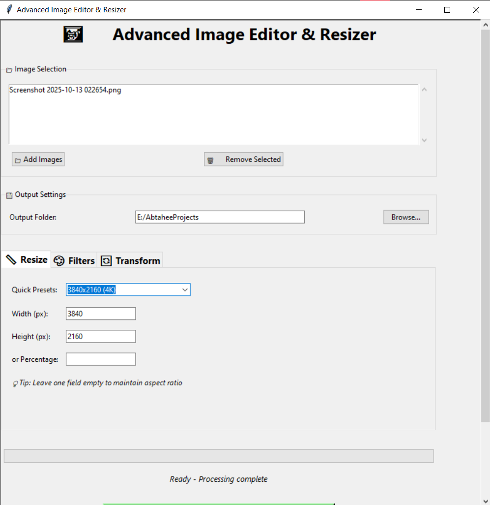
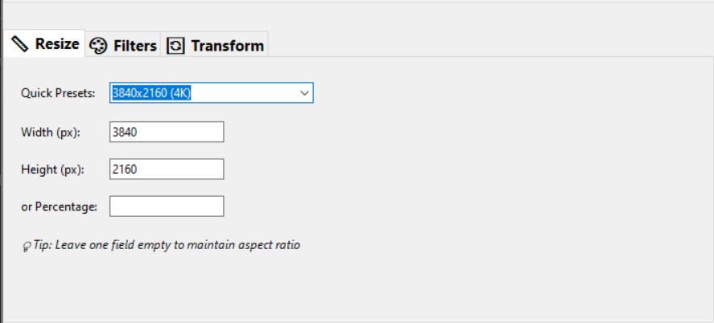
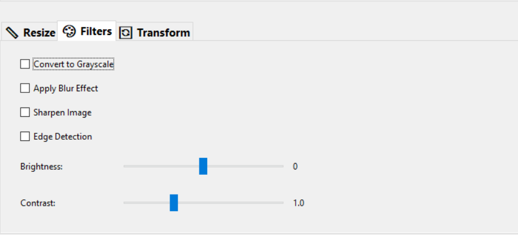
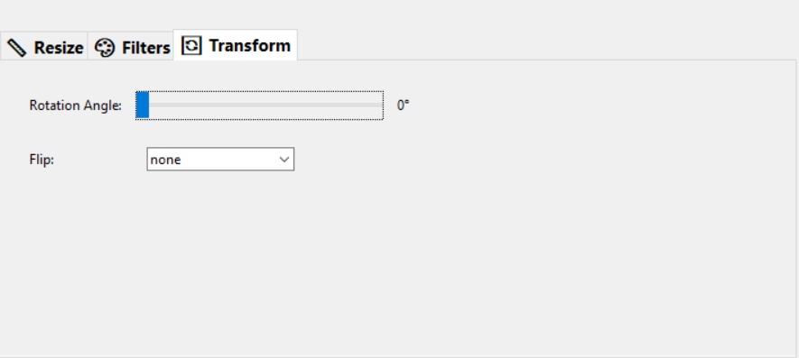

# 🖼️ Advanced Image Editor & Resizer

### A modern GUI-based image editing and resizing tool built with Python and Tkinter

---




## 🚀 Overview

The **Advanced Image Editor & Resizer** is a desktop application designed for quick and batch image processing.  
It provides a simple and elegant **Tkinter-based GUI** that allows users to **resize**, **filter**, and **transform** multiple images simultaneously with live progress updates.

Whether you need to prepare images for web uploads, social media, or custom resolutions — this tool simplifies your workflow.

---

## ✨ Key Features

### 🧩 Core Functionality
* **Batch Image Processing:** Process multiple images at once.  
* **Smart Resizing Options:** * Custom width & height  
    * Resize by percentage  
    * Maintain aspect ratio automatically  
    * Preset sizes for social media & devices  

### 🎨 Filters
* Convert to **Grayscale** * Apply **Blur**, **Sharpen**, or **Edge Detection** * Adjust **Brightness** and **Contrast**

### 🔄 Transformations
* **Rotate** images (0°–360°)  
* **Flip** horizontally, vertically, or both  

### 💾 Output Management
* Choose custom **output folder** * Track **real-time progress** with a progress bar  
* Displays completion & error messages  

### 🖱️ Intuitive GUI
* Scrollable, modern Tkinter UI  
* Organized into **tabs** (`Resize`, `Filters`, `Transform`)  
* Responsive layout with styled widgets  

---

## 🧰 Technologies Used

| Component | Description |
| :---------- | :------------- |
| **Python 3.x** | Core programming language |
| **Tkinter** | GUI framework |
| **OpenCV (cv2)** | Image processing engine |
| **NumPy** | Numerical computations for filters |
| **Threading** | Background image processing |

---

## 📦 Installation

### 🪟 Windows / 💻 macOS / 🐧 Linux

1.  **Clone this repository**
    ```bash
    git clone [https://github.com/](https://github.com/)<your-username>/image-resizer-tool.git
    cd image-resizer-tool
    ```

2.  **Create a virtual environment (recommended)**
    ```bash
    python -m venv .venv
    ```

3.  **Activate the environment**

    * **Windows:**
        ```bash
        .venv\Scripts\activate
        ```
    * **macOS/Linux:**
        ```bash
        source .venv/bin/activate
        ```

4.  **Install dependencies**
    ```bash
    pip install -r requirements.txt
    ```

